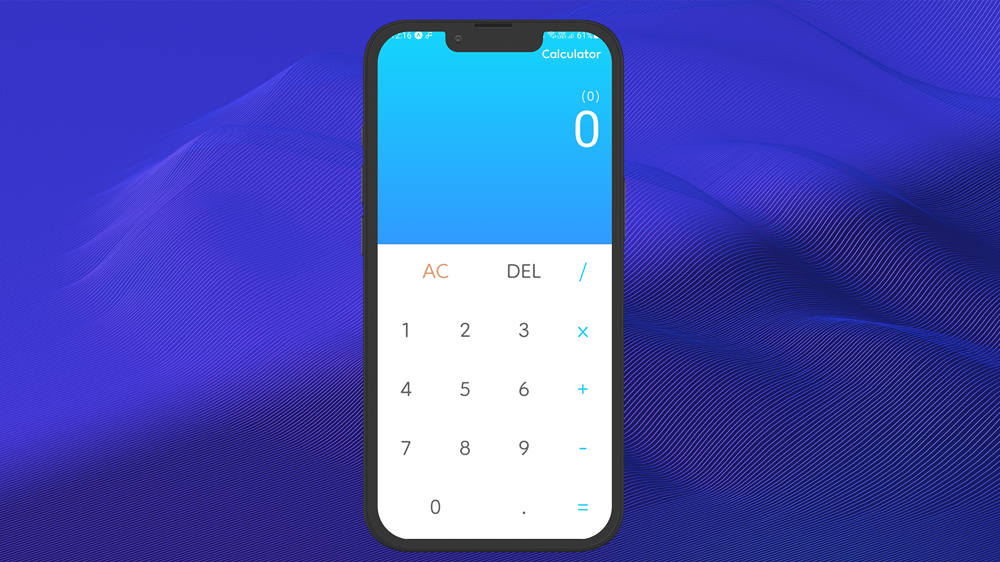
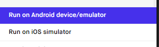

<h1 align="center">
	◽ Calculadora ◽
</h1>

<p align="center">
	
</p>

### ◽ Projeto 💻
	Uma calculadora de operações básicas.
###   ◽ Tecnologias ✨
-   [ ] React Native
-   [ ] Typescript
-   [ ] Expo
-   [ ] Gradient colors
-   [ ] Expo Google Fonts

### Executando o projeto

 1. Ultlize o **npm install** ou o **yarn** para instalar as dependências necessárias, com isso inicialize o projeto:
	 ```cl
	expo start
	```
 2. Com o projeto rodando no terminal podemos visualizar o aplicativo pelo aplicativo Expo Go disponível na Play Store e na Apple Store:
 
	◽ [🍎Apple Store](https://apps.apple.com/app/apple-store/id982107779)
	
	◽ [📱 Play Store](https://play.google.com/store/apps/details?id=host.exp.exponent&referrer=www)
	
	2.1 Caso tenha um emulador instalado execute o projeto utilizando a opção:
	<p>
		
	</p>

 3. Tudo pronto! Agora você pode começar a resolver seus problemas matemáticos🧐.

<div align="center">
	<small>Desenvolvido por Marcos Pinto 😃 - Fevereiro/2022</small>
	
[](https://www.linkedin.com/in/marcos-gabriel-costa-pinto-4879b81ab/)
	
</div>
